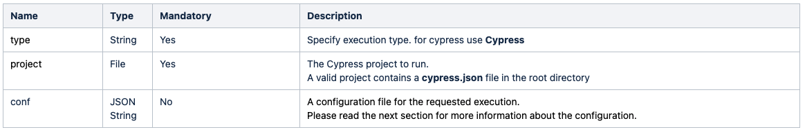
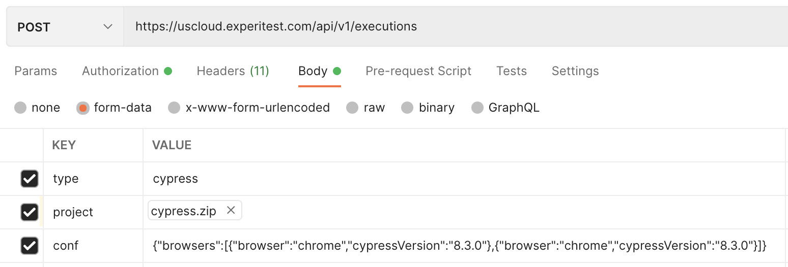
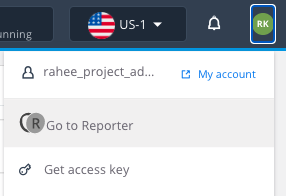
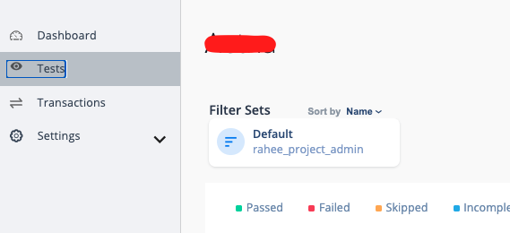
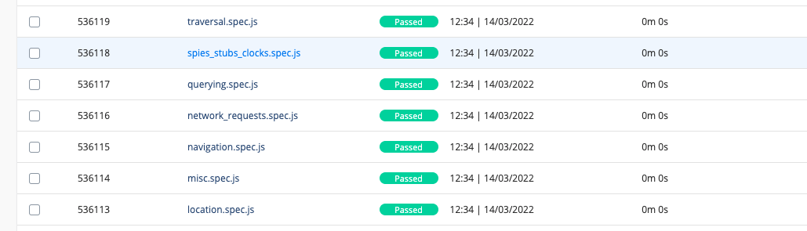

# Cypress-With-Continuous-Testing-Digital.ai

This repository will briefly go over how to trigger Cypress tests using a sample project.
The sample project can be [downloaded here](https://cypressprojectsample.s3.us-east-2.amazonaws.com/cypress.zip).

To learn more in depth about the APIs, reference [this documentation page](https://docs.experitest.com/display/TE/Cypress).

## Start a Cypress Execution

To trigger Cypress tests, we need to rely on an API call:

POST - /api/v1/executions

Parameters accepted:



Here is a sample request sent using Postman:



For copy / paste purposes, here is the 'conf' section in plain text:

```
{"browsers":[{"browser":"chrome","cypressVersion":"8.3.0"},{"browser":"chrome","cypressVersion":"8.3.0"}]}
```

### The equivalent command in cURL:

```
curl --location --request POST 'https://uscloud.experitest.com/api/v1/executions' \
--header 'Authorization: Bearer <Insert_Your_Access_Key>' \
--form 'type="cypress"' \
--form 'project=@"/Users/RKhan/Desktop/cypress_projects/cypress.zip"' \
--form 'conf="{\"browsers\":[{\"browser\":\"chrome\",\"cypressVersion\":\"8.3.0\"},{\"browser\":\"chrome\",\"cypressVersion\":\"8.3.0\"}]}"'
```

## Get Cypress Execution Status

To see the Cypress tests progress, we need to run an API to get the status information:

GET - /api/v1/executions/{Execution_ID}/status

### The equivalent command in cURL:

```
curl --location --request GET 'https://uscloud.experitest.com/api/v1/executions/<insert_test_run_id>/status' \
--header 'Authorization: Bearer <Insert_Your_Access_Key>'
```

## Viewing The Results

In the SeeTest Cloud UI, using the following steps, we can navigate to the SeeTest Reporter where the results are stored:

1. Login to the SeeTest Cloud
2. Click on your Initials > Go To Reporter:



3. Navigate to Tests tab:



If the execution was recent, it should show up in the list:



Otherwise also searching for the test results using the Filter option by searching with "test.run.id" followed with the Execution ID received from the API call:


